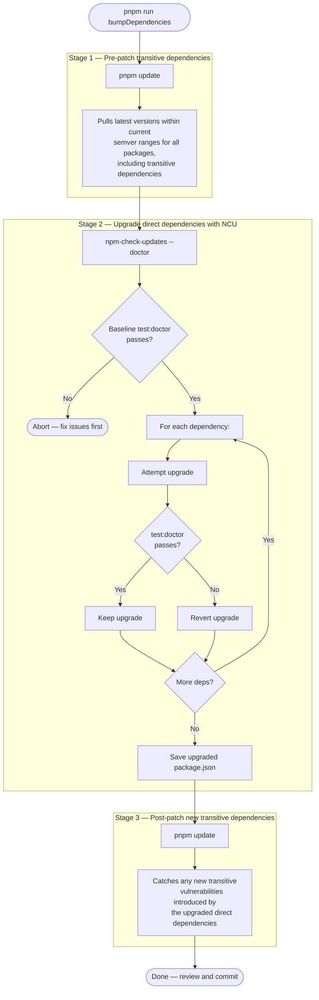
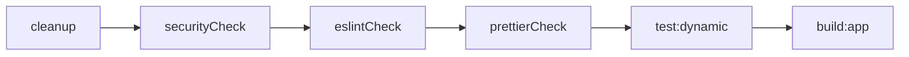
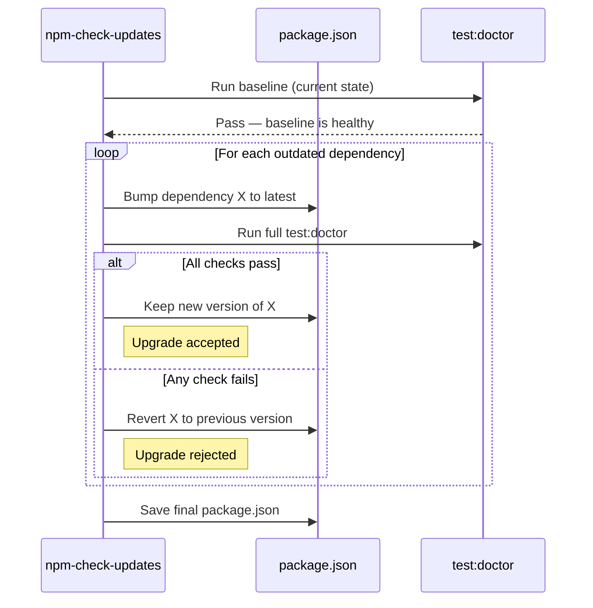

# Angular Base

Starter kit for building Angular 21 applications with Vitest-powered tests, supply chain security, and a local test pipeline that mirrors your CI workflow.

## Navigation

- [Key features](#key-features)
- [Before you start](#before-you-start)
- [Quick start](#quick-start)
- [Useful scripts](#useful-scripts)
- [Testing & coverage](#testing--coverage)
- [Dependency management and security](#dependency-management-and-security)
- [Next steps](#next-steps)

## Key features

[(back to menu)](#navigation)

- Angular 21 application scaffold with SCSS, strict TypeScript, and `@angular/build` as the unified build and test toolchain.
- Vitest (via `@angular/build:unit-test`) replaces Karma/Jasmine for fast, standards-aligned unit tests.
- Coverage thresholds enforced at 80% for statements, branches, functions, and lines — configured in `angular.json`.
- Team-friendly tooling: ESLint, Prettier, Husky + lint-staged, and a one-shot `test` script that simulates CI locally.
- `pnpm run bumpDependencies` upgrades dependencies but aborts if the test suite fails.
- Supply chain hardening: exact version pinning, 24-hour package quarantine, strict peer dependency resolution, and transitive vulnerability overrides in `pnpm-workspace.yaml`.
- GitHub Actions CI with a composite setup action at `.github/actions/setup/` and a separate `bump-dependencies` workflow.
- Dependabot monitors GitHub Actions for updates; npm dependencies are managed by the `bumpDependencies` pipeline.

## Before you start

[(back to menu)](#navigation)

Match your local runtime with the versions declared in the `engines` field inside `package.json`. That field is the source of truth.

## Quick start

[(back to menu)](#navigation)

1. Install dependencies: `pnpm install`.
2. Start the dev server: `pnpm run start`.
3. Open `http://localhost:4200/` to verify the app is running. Hot reload is on by default.

> For production builds run `pnpm run build:app`. The output goes to `dist/`.

## Useful scripts

[(back to menu)](#navigation)

| Script                      | Purpose                                                                                                                                            |
| --------------------------- | -------------------------------------------------------------------------------------------------------------------------------------------------- |
| `pnpm run start`            | Start the Angular dev server with hot reload.                                                                                                      |
| `pnpm run test`             | Local "mini CI" that mirrors `.github/workflows/ci.yml`: cleanup, security audit, ESLint, Prettier check, unit tests, and build.                   |
| `pnpm run test:doctor`      | Identical to `test` — used as NCU's per-dependency validation gate. See [Dependency management and security](#dependency-management-and-security). |
| `pnpm run test:static`      | Security audit + ESLint + Prettier checks only (no tests, no build).                                                                               |
| `pnpm run test:dynamic`     | Run Vitest unit tests via `ng test --configuration=ci`.                                                                                            |
| `pnpm run watch:test`       | Run Vitest in watch mode with continuous coverage output.                                                                                          |
| `pnpm run build`            | Alias for `build:app`.                                                                                                                             |
| `pnpm run build:app`        | Production build via `ng build`.                                                                                                                   |
| `pnpm run watch`            | Build in watch mode with development configuration.                                                                                                |
| `pnpm run cleanup`          | Remove `.angular/`, `coverage/`, and `dist/`.                                                                                                      |
| `pnpm run eslintCheck`      | Run ESLint on all TypeScript files under `src/`.                                                                                                   |
| `pnpm run prettierCheck`    | Check formatting for `src/` and `public/` files.                                                                                                   |
| `pnpm run securityCheck`    | Run `pnpm audit --audit-level high`. Fails on high or critical vulnerabilities.                                                                    |
| `pnpm run securityFix`      | Run `pnpm update` to pull the latest semver-compatible versions of all dependencies, including transitive ones.                                    |
| `pnpm run bumpDependencies` | Full dependency upgrade pipeline with security validation. See [Dependency management and security](#dependency-management-and-security).          |
| `pnpm run updatePnpm`       | Update the pnpm package manager itself via `corepack up`.                                                                                          |
| `pnpm run prepare`          | Install Husky git hooks (runs automatically after `pnpm install`).                                                                                 |
| `pnpm run lintStaged`       | Run lint-staged on currently staged files (called by Husky pre-commit hook).                                                                       |

Husky runs `lint-staged` before every commit to keep formatting and linting green.

## Testing & coverage

[(back to menu)](#navigation)

- `pnpm run test:dynamic` runs all unit tests through Vitest via the `@angular/build:unit-test` builder.
- Coverage is collected automatically in CI mode. Reports land in `coverage/` as both LCOV and plain text.
- Open `coverage/index.html` in your browser to browse the HTML report.
- Coverage thresholds are set at 80% for all four metrics (statements, branches, functions, lines) and enforced by `angular.json`. A test run that falls below any threshold fails the build.
- The `ci` configuration is the default; the `watch` configuration keeps Vitest running in the background and re-runs affected tests on file save.

## Dependency management and security

[(back to menu)](#navigation)

The project ships a semi-automated pipeline that keeps dependencies up to date while ensuring nothing breaks and no new vulnerabilities slip through. The pipeline is split into focused scripts that compose together.

### How `bumpDependencies` works

Running `pnpm run bumpDependencies` executes three stages back-to-back:

**Why three stages?** Direct dependency upgrades (Stage 2) can introduce new transitive dependencies. The final `pnpm update` (Stage 3) ensures those transitive dependencies resolve to the latest patched versions within their semver ranges.

### How `test:doctor` validates each upgrade

In angular-base, `test:doctor` and `test` are identical pipelines — there are no e2e tests or API docs generation steps to omit. NCU runs `test:doctor` as its validation gate for every single dependency upgrade. If any step fails, that specific upgrade is reverted:

| Step            | What it catches                                                                                    |
| --------------- | -------------------------------------------------------------------------------------------------- |
| `securityCheck` | Rejects upgrades that introduce high/critical vulnerabilities via `pnpm audit --audit-level high`. |
| `eslintCheck`   | Catches type errors, unsafe patterns, and breaking API changes surfaced by `typescript-eslint`.    |
| `prettierCheck` | Ensures formatting consistency is preserved.                                                       |
| `test:dynamic`  | Validates runtime behavior has not regressed via Vitest.                                           |
| `build:app`     | Confirms the production build compiles without errors.                                             |

### How NCU doctor mode decides per dependency

### Security infrastructure

The project provides several layers for managing vulnerability risk:

- **`.npmrc`** — `save-exact=true` pins future `pnpm add` operations to exact versions, preventing unintended semver drift. `engine-strict=true` aborts install if the active Node version does not satisfy `engines`. `strict-peer-dependencies=true` surfaces incompatible dependency trees early.

- **`auditConfig.ignoreGhsas`** — An allowlist in `pnpm-workspace.yaml` for GHSA identifiers that have no fix available (typically in deeply nested devDependencies). When a GHSA is ignored, the audit still reports it but does not fail the build. This keeps `securityCheck` passing so it can catch new vulnerabilities instead of being permanently broken.

- **`overrides`** — Forces specific transitive dependency versions when a parent package pins a vulnerable range. Defined in `pnpm-workspace.yaml`. Use sparingly and with bounded version ranges (e.g., `">=3.1.4 <4.0.0"`, not `">=3.1.4"`).

- **`minimumReleaseAge: 1440`** — Configured in `pnpm-workspace.yaml`. Blocks installation of packages published less than 24 hours ago, providing a quarantine window against supply chain attacks that exploit the brief window between a package being published and being flagged as malicious.

- **Dependabot** — Configured in `.github/dependabot.yml` for the GitHub Actions ecosystem only. npm dependencies are managed by the `bumpDependencies` pipeline (NCU doctor mode), not by Dependabot.

### When to use each script

| Scenario                                           | Script                                                           |
| -------------------------------------------------- | ---------------------------------------------------------------- |
| Routine dependency maintenance                     | `pnpm run bumpDependencies`                                      |
| Quick patch for a known vulnerability              | `pnpm run securityFix`                                           |
| Check if current dependencies have vulnerabilities | `pnpm run securityCheck`                                         |
| Update the pnpm package manager itself             | `pnpm run updatePnpm`                                            |
| A GHSA appears with no available fix               | Add its ID to `auditConfig.ignoreGhsas` in `pnpm-workspace.yaml` |
| A transitive dependency needs a forced version     | Add a bounded override to `overrides` in `pnpm-workspace.yaml`   |

## Next steps

[(back to menu)](#navigation)

Build on top of this template by adding your own components, services, and feature modules. The project layout, strict TypeScript configuration, and supply chain hardening are designed to scale with those additions without requiring changes to the base tooling setup.
